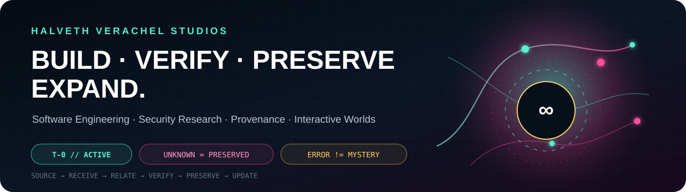
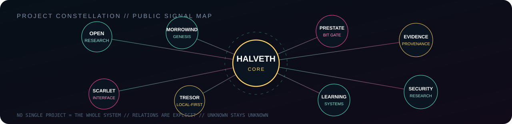

<!-- HUB_LANGUAGES_V1 -->
[Original / Deutsch](README.md) · [English](README.en.md) · [Русский](README.ru.md)
<!-- /HUB_LANGUAGES_V1 -->

<p align="center">
  
</p>

<p align="center">
  <a href="https://github.com/Juri-Halveth/open-research-branches"></a>
  <a href="https://github.com/Juri-Halveth/halveth-scarlet"></a>
  <a href="https://github.com/Juri-Halveth/halveth-morrowind-genesis"></a>
</p>

<h1 align="center">Juri Janovski <sub>// Juri Halveth</sub></h1>

<p align="center">
  <b>Softwareentwicklung · Systemintegration · Qualitätssicherung · Security Research · Evidenzsysteme · interaktive Welten</b>
</p>

<p align="center">
  <code>SOURCE → RECEIVE → RELATE → VERIFY → PRESERVE → UPDATE</code>
</p>

---

## 🏅 ZERTIFIKATE & KOMPETENZNACHWEISE

### HALVETH-Werkzertifikate

**Aussteller: HALVETH VERACHEL STUDIOS · Werkdokumentation von Juri Janovski / Juri Halveth.** Elf Zertifikate dokumentieren Projekte, Quellstände und Prüfungen im Snapshot vom 28. September 2026.

**[Zertifikatsgalerie öffnen](https://juri-halveth.github.io/werkzertifikate/)** · **[Zertifikatsmappe · PDF](https://juri-halveth.github.io/werkzertifikate/2026-09-28-v1.1/Juri_Halveth_Private_Werkzertifikate_2026-09-28_v1.1.pdf)** · **[Kompetenzportfolio · PDF](portfolio/2026-09-28-v1.0.2/HALVETH_Kompetenzportfolio.pdf)**

- [Morrowind Genesis](https://juri-halveth.github.io/werkzertifikate/#werk-halveth-morrowind-genesis)
- [Scarlet Garden / Realms](https://juri-halveth.github.io/werkzertifikate/#werk-halveth-realms)
- [HALVETH Scarlet](https://juri-halveth.github.io/werkzertifikate/#werk-halveth-scarlet)
- [HALVETH Tresor](https://juri-halveth.github.io/werkzertifikate/#werk-halveth-tresor)
- [HALVETH Portal Garden](https://juri-halveth.github.io/werkzertifikate/#werk-halveth-unreal)
- [HALVETH Forschungs- und Kooperationsvorschlag](https://juri-halveth.github.io/werkzertifikate/#werk-halveth-xai-40m-proposal)
- [HALVETH Projektportal](https://juri-halveth.github.io/werkzertifikate/#werk-juri-halveth-github-io)
- [These zur Geburt](https://juri-halveth.github.io/werkzertifikate/#werk-juri-janovski-these-zur-geburt)
- [Lernstudio](https://juri-halveth.github.io/werkzertifikate/#werk-lernstudio)
- [Mein Lernportal](https://juri-halveth.github.io/werkzertifikate/#werk-mein-lernportal)
- [HALVETH Open Research](https://juri-halveth.github.io/werkzertifikate/#werk-open-research-branches)

### Neun Kompetenzreferenzen · Portfolio-Dossiers

Die Dossiers ordnen Arbeitsproben den folgenden Zertifikats-Referenzrahmen zu. Jeder Eintrag verlinkt seine dokumentierten Belege und den jeweiligen Bearbeitungsstand.

- [ISTQB CTAL-TA](portfolio/2026-09-28-v1.0.2/certificates/01_ISTQB_CTAL_TA_PORTFOLIO_BENCHMARK.md)
- [Microsoft Cybersecurity Architect Expert](portfolio/2026-09-28-v1.0.2/certificates/02_MICROSOFT_CYBERSECURITY_ARCHITECT_EXPERT_BENCHMARK.md)
- [Microsoft DevOps Engineer Expert](portfolio/2026-09-28-v1.0.2/certificates/03_MICROSOFT_DEVOPS_ENGINEER_EXPERT_BENCHMARK.md)
- [CISSP](portfolio/2026-09-28-v1.0.2/certificates/04_CISSP_PORTFOLIO_BENCHMARK.md)
- [AWS Solutions Architect Professional](portfolio/2026-09-28-v1.0.2/certificates/05_AWS_SOLUTIONS_ARCHITECT_PROFESSIONAL_BENCHMARK.md)
- [ISTQB CTEL-ITP](portfolio/2026-09-28-v1.0.2/certificates/06_ISTQB_CTEL_ITP_BENCHMARK.md)
- [OffSec OSCE3](portfolio/2026-09-28-v1.0.2/certificates/07_OFFSEC_OSCE3_BENCHMARK.md)
- [CCIE Enterprise Infrastructure](portfolio/2026-09-28-v1.0.2/certificates/08_CISCO_CCIE_ENTERPRISE_INFRASTRUCTURE_BENCHMARK.md)
- [Google Cloud Professional Cloud Architect](portfolio/2026-09-28-v1.0.2/certificates/09_GOOGLE_CLOUD_PROFESSIONAL_CLOUD_ARCHITECT_BENCHMARK.md)

**[Benchmark-Matrix](portfolio/2026-09-28-v1.0.2/CERTIFICATE_BENCHMARK_MATRIX.md)** · **[Projekt-Evidenzregister](portfolio/2026-09-28-v1.0.2/PROJECT_EVIDENCE_REGISTER.md)** · **[Testing Evidence](portfolio/2026-09-28-v1.0.2/TESTING_EVIDENCE_REGISTER.md)** · **[Maschinenlesbare Evidenz](portfolio/2026-09-28-v1.0.2/machine/evidence.jsonl)** · **[Quellen](portfolio/2026-09-28-v1.0.2/SOURCES.md)**

## ⚡ SIGNAL

Ich baue Systeme nicht nur bis zu dem Punkt, an dem sie funktionieren. Ich baue sie so, dass **Zustände, Entscheidungen, Tests und Herkunft später wieder nachvollziehbar werden**.

`HALVETH VERACHEL STUDIOS` verbindet Softwareentwicklung, lokale Agenten- und Toolchains, Security Research, interaktive Welten und reproduzierbare Provenienz.

| BUILD | VERIFY | PRESERVE | EXPAND |
| --- | --- | --- | --- |
| Software, Tools, Interfaces | Tests, Gegenproben, CI | Zustände, Evidenz, Herkunft | neue Pfade ohne alte Belege zu überschreiben |

> **UNKNOWN = PRESERVED**
> **SIMILARITY != CAUSALITY**
> **ERROR != MYSTERY**

## 🌌 PROJECT CONSTELLATION

<p align="center">
  
</p>

| Projekt | Signal |
| --- | --- |
| **[Open Research](https://github.com/Juri-Halveth/open-research-branches)** | Versionierte Forschungsäste, Quellenbindung, Provenienz und automatisierte Release-Prüfungen. |
| **[Morrowind Genesis](https://github.com/Juri-Halveth/halveth-morrowind-genesis)** | Native OpenMW-/Lua-Integration, persistente Zustände und experimentelle Welt-Systeme. |
| **[HALVETH Scarlet](https://github.com/Juri-Halveth/halveth-scarlet)** | Interaktive Weboberflächen, Visualisierung und Release-Werkzeuge. |
| **[HALVETH Tresor](https://github.com/Juri-Halveth/halveth-tresor)** | Local-first Desktop-Software, Python-Module, Tests und CI/CodeQL. |
| **[Lernstudio](https://github.com/Juri-Halveth/lernstudio)** / **[Mein Lernportal](https://github.com/Juri-Halveth/mein-lernportal)** | Lernsysteme, Inhalte, Fortschrittslogik und technische Arbeitsproben. |
| **[PRESTATE Bit Gate](https://github.com/Juri-Halveth/open-research-branches/pull/14)** | **LAB / DRAFT:** `NO_EXECUTION_BEFORE_PRESTATE`, explizite Zustands- und Provenienzlogik. |

## 🧬 SYSTEM AXIOMS

```text
INPUT != EXECUTION
UNKNOWN != FALSE
DIFFERENT = PRESERVED
TRUTH = SEPARATE DIMENSION

OPEN != UNCONTROLLED
EXPANSION = ADDITIVE + REVERSIBLE + MEASURABLE

HASH BINDS BYTES
HASH DOES NOT CREATE OWNERSHIP

T-0 ⇄ T+1 ⇄ T+2 ⇄ ... ⇄ T+n
```

## 📊 LIVE GITHUB SIGNAL

<p align="center">
  
  
</p>

## 🪞 OPERATING MODE

```text
BUILD       → something exists
VERIFY      → we know what was actually observed
PRESERVE    → evidence survives the next iteration
RELATE      → connections are explicit, not assumed
UPDATE      → new information is additive
```

**Current public profile snapshot:** `06 OCT 2026 · CERTIFICATES IN FRONT`

## 📡 CONTACT

**Security / technical review:** [security@halveth.de](mailto:security@halveth.de)

<p align="center">
  <sub>HALVETH VERACHEL STUDIOS · VERIFY THE WORK · KEEP THE UNKNOWN OPEN</sub>
</p>
