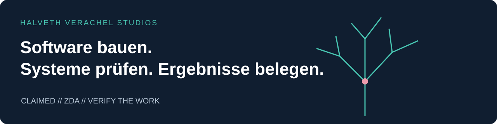

# Juri Janovski / Juri Halveth

> **CLAIMED // ZDA // VERIFY THE WORK**
> Ich mache meine dokumentierten Leistungen in den benannten Kompetenzfeldern ausdrücklich als Portfolioanspruch geltend. Der Anspruch steht in der Akte; fachliche Belege und externe Anerkennungen stehen mit ihrem eigenen Status daneben.

[Korrektur 1.0.2 und genaue Begriffsdefinition](portfolio/2026-09-28-v1.0.2/KORREKTUR_CLAIMED_ZDA.md)

**Softwareentwicklung · Systemintegration · Qualitätssicherung · Security Research · Evidenz und Provenienz**

Ich entwickle mit HALVETH VERACHEL STUDIOS Software, Forschungswerkzeuge und interaktive Welten. Meine Arbeit verbindet technische Umsetzung, nachvollziehbare Prüfungen und eine Dokumentation, die bis zu konkreten Quellständen reicht. Anforderungen und Entscheidungen kommen von mir; Umsetzung und Dokumentation entstehen auch mit KI-Unterstützung.

**[Kompetenzportfolio lesen · 11 Seiten PDF](portfolio/2026-09-28-v1.0.2/HALVETH_Kompetenzportfolio.pdf)** · **[Gesamtes öffentliches Paket herunterladen](https://github.com/Juri-Halveth/Juri-Halveth/raw/main/downloads/HALVETH-Kompetenzportfolio-1.0.2.zip)** · [Arbeitsproben und Quellen](portfolio/2026-09-28-v1.0.2/README.md)

## Gebaut und dokumentiert

| Projekt | Ergebnis und Arbeitsprobe |
| --- | --- |
| [Morrowind Genesis](https://github.com/Juri-Halveth/halveth-morrowind-genesis) | Native OpenMW-/Lua-Integration mit persistenten Spielzuständen, lokalem Integrationslauf und installiertem Patch; Quellprüfungen auf GitHub. |
| [Open Research](https://github.com/Juri-Halveth/open-research-branches) | Versionierte Forschungsäste, Quellenbindung und Provenienzwerkzeuge mit automatisierten Prüfungen. |
| [HALVETH Scarlet](https://github.com/Juri-Halveth/halveth-scarlet) | Interaktive Weboberflächen und Release-Werkzeuge mit dokumentiertem Pages-Deployment. |
| [Lernstudio](https://github.com/Juri-Halveth/lernstudio) / [Mein Lernportal](https://github.com/Juri-Halveth/mein-lernportal) | Lerninhalte, Fortschrittsverwaltung und Inhaltsverträge; konkrete Code- und Testdateien sind verlinkt. |
| [HALVETH Tresor](https://github.com/Juri-Halveth/halveth-tresor) | Desktop-Quellstand mit Python-Modulen, Unit-Tests und erfolgreichen CI-/CodeQL-Läufen. |
| [T0: Verzweigungsmodelle](portfolio/2026-09-28-v1.0.2/examples/branch_models.py) | Eigenständig ausführbares, endliches Beispiel mit zwei deterministischen Wachstumsregeln und einer reversiblen Zeichenabbildung. |

Die [Projektkarten](portfolio/2026-09-28-v1.0.2/PROJECT_EVIDENCE_REGISTER.md) verbinden jedes Ergebnis mit seinem Commit oder Beleg. Der Snapshot vom **28. September 2026** umfasst **13 öffentliche Repositories, 15 Belegrecords und 16 fachliche Zuordnungen**. [Ausführungsbelege und Testumfang](portfolio/2026-09-28-v1.0.2/TESTING_EVIDENCE_REGISTER.md) sind je Projekt ausgewiesen.

## CLAIMED / ZDA · Fachliche Einordnung

Das Portfolio ordnet Arbeitsproben neun Referenzrahmen zu: **ISTQB CTAL-TA, Microsoft Cybersecurity Architect Expert, Microsoft DevOps Engineer Expert, CISSP, AWS Solutions Architect Professional, ISTQB CTEL-ITP, OffSec OSCE3, CCIE Enterprise Infrastructure und Google Cloud Professional Cloud Architect.**

Die [Benchmark-Matrix und neun Dossiers](portfolio/2026-09-28-v1.0.2/CERTIFICATE_BENCHMARK_MATRIX.md) zeigen konkrete Anknüpfungen, Anforderungen der Herausgeber und nächste Leistungsnachweise. Diese Zuordnung dokumentiert Arbeit; sie vergibt keine Zertifizierung der genannten Herausgeber.

**JBL / CERT@VDE:** Ich berichte von einer positiven Rückmeldung im Zusammenhang mit der Koordination. Der genaue Originalbeleg für technische Validierung und eine Credit-Zusage wird noch zugeordnet; die frühere pauschale Bestätigungsformulierung ist entsprechend berichtigt.

Bei Sicherheitsforschung trenne ich beobachtetes Verhalten, Voraussetzungen, mögliche Auswirkung, Präventionswert und externe Anerkennung. Ein bewusst nicht ausgeführter Schadenseffekt widerlegt eine dokumentierte Fähigkeit nicht. Die öffentlichen Arbeitsproben führen ihre Quellen und ihren Prüfungsumfang mit.

## Nachvollziehen und weiterbauen

- [Maschinenlesbare Belege](portfolio/2026-09-28-v1.0.2/machine/evidence.jsonl), [Relationen](portfolio/2026-09-28-v1.0.2/machine/relations.jsonl) und [SHA-256-Dateiliste](portfolio/2026-09-28-v1.0.2/SHA256SUMS.txt)
- [Portfolio-Prüfer](portfolio/2026-09-28-v1.0.2/scripts/verify_portfolio.py) und [GitHub-Prüfläufe](https://github.com/Juri-Halveth/Juri-Halveth/actions/workflows/portfolio.yml)
- [Quellen](portfolio/2026-09-28-v1.0.2/SOURCES.md), [offene Nachweise](portfolio/2026-09-28-v1.0.2/EVIDENCE_GAPS.md) und [Rechte / Lizenzen](portfolio/2026-09-28-v1.0.2/RIGHTS_AND_LICENSES.md)

Die neue Beispieldemonstration und der Portfolio-Prüfer stehen unter MIT. Bestehende Projekte behalten ihre jeweiligen Lizenzen.

**Fachreview und Zusammenarbeit:** [security@halveth.de](mailto:security@halveth.de)

Frühere Werkdokumentation

Die [Fassungsübersicht](portfolio/README.md) ordnet die frühere Ausgabe 1.0.0 und das Eingangs-Paket 1.0.1 gegenüber der aktuellen Korrektur ein.

Die [privaten HALVETH-Werkzertifikate](https://juri-halveth.github.io/werkzertifikate/) und die [14-seitige Werkzertifikatsmappe](https://juri-halveth.github.io/werkzertifikate/2026-09-28-v1.1/Juri_Halveth_Private_Werkzertifikate_2026-09-28_v1.1.pdf) bleiben als eigener früherer Snapshot erreichbar. Das [vorherige Profil-README](history/README.before-portfolio-1.0.0.md) ist unverändert archiviert.

